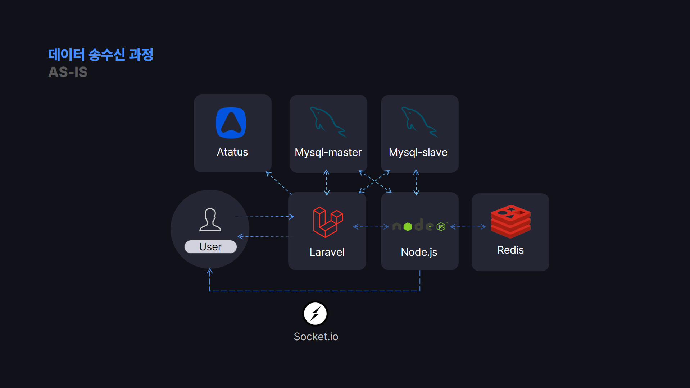
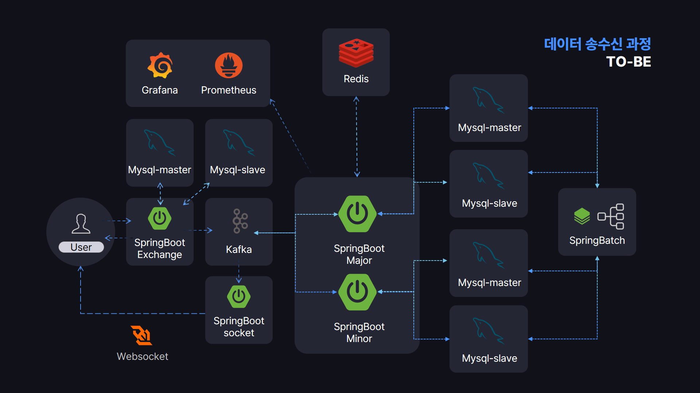

# 코인 거래소 프로젝트

코인 거래소 개발을 위한 아키텍처 설계 개요는 다음과 같습니다.

### 기존 구조와 문제점

laravel : 벨리데이션 및 사이트 관련 api 서버

nodejs : 체결, 차트, 타코인 블록체인 연결 관련 서버

- **Node.js 서버 부하 증가**
    - Node.js 서버가 체결, 차트, 블록체인 연결 등 다양한 작업을 담당하면서 과부하 발생.
    - 특히 체결 부분에서 모든 코인에 대한 거래를 처리하며 높은 부하가 발생.
- **트랜잭션 중복으로 인한 Deadlock 발생 가능성**
    - Laravel과 Node.js가 동일한 DB를 사용하면서 트랜잭션 충돌로 인한 Deadlock 가능성이 존재.
- **HTTP 방식의 이벤트 전송에 따른 데이터 유실 위험**
    - Laravel에서 Node.js 서버로 체결 이벤트를 HTTP 요청으로 전송하면서 데이터 유실 가능성이 있음.
- **Laravel의 배치 작업 병렬 처리의 어려움**
    - 일일 평균가, 종가, 일일 거래 금액 등의 배치 처리가 병렬 처리에 적합하지 않아 비효율적.
- **금융 데이터의 타입 검사 필요**
    - 금융 데이터의 중요성을 고려하여 엄격한 타입 체크 필요.

### 개선 방안

- **코인별 서비스 분리로 부하 분산**
    - 메이저 코인과 마이너 코인을 분리하여 독립적인 서비스로 운영하고, 부하가 증가하면 각 코인별로 마이크로서비스화하여 스케일 아웃이 용이하도록 구성.
    - 체결 프로세스를 단순히 쿼리 처리가 아닌 자료구조 및 redis 활용하여 빠르게 체결 되도록 개선
- **별도의 DB와 샤딩을 통한 데이터 독립성**
    - Laravel에서 벨리데이션을 담당하는 별도의 Exchange 앱을 운영하며, 메이저 및 마이너 코인용 DB를 각각 복제 및 샤딩하여 독립적인 저장소로 구분.
    - 각 데이터베이스의 독립성으로 인해 역할과 경계가 명확하게 구분됨.
- **Kafka를 통한 데이터 전송 안정성 확보**
    - Kafka를 사용해 앱 간 데이터 전달 속도를 개선하고, 데이터 유실 가능성을 최소화.
- **Spring Batch로 효율적인 배치 처리**
    - Spring Batch를 통해 대용량 데이터의 집계 작업을 효율적으로 처리.
    - 쓰레드 처리 및 통합 작업으로 일일 데이터 집계 등의 배치 작업을 빠르게 수행 가능.
- **엄격한 타입 체크를 통한 데이터 안정성 확보**
    - 금융 데이터의 특성상, 데이터 타입 검사를 철저히 하여 데이터의 정확성과 안전성을 보장.

이러한 개선 방안을 통해 효율적이고 안정적인 코인 거래소 서비스를 구축하기 위해 노력하였습니다.

- [코인 거래소 체결 프로세스 Spring Boot로 마이그레이션 [개요 (1)]](https://lead-icicle-cc1.notion.site/Spring-Boot-1-12da7b429bd08095bf92ca3e84960ec8)
- [코인 거래소 체결 프로세스 Spring Boot로 마이그레이션 [앱실행 (2)]](https://lead-icicle-cc1.notion.site/Spring-Boot-2-12da7b429bd08052a573cfeda8e94187)
- [코인 거래소 체결 프로세스 Spring Boot로 마이그레이션 [체결 로직 개선 (3)]](https://lead-icicle-cc1.notion.site/Spring-Boot-3-12ea7b429bd0802aa15cd4764cf65be7)